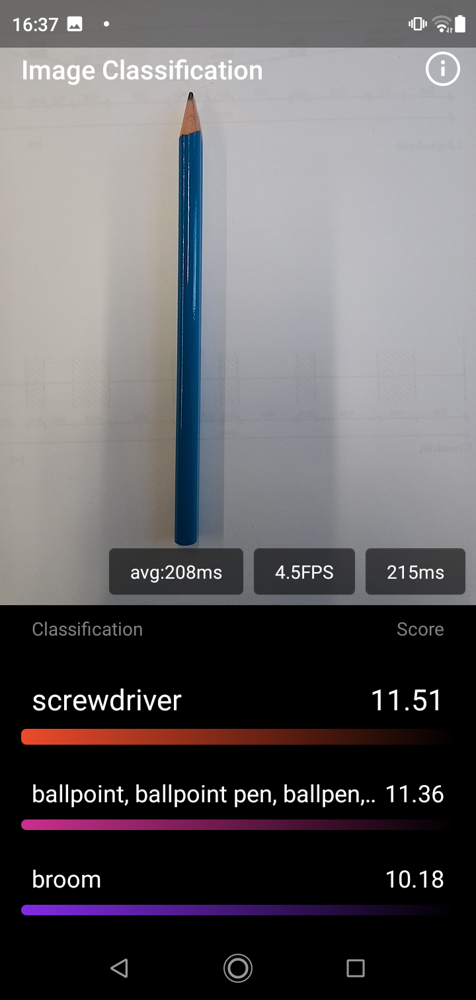
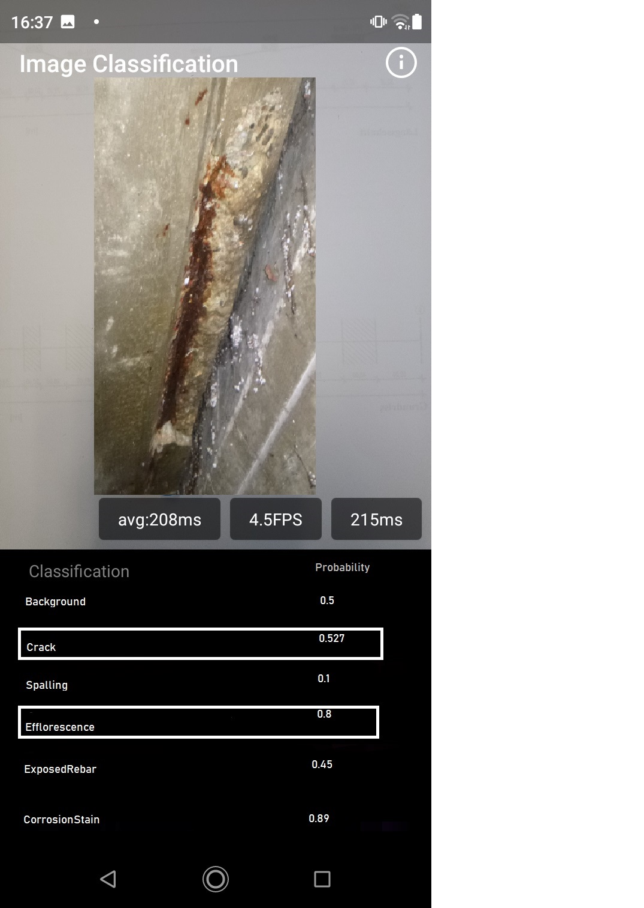

# Dacl-Android-App
This repo is forked from the Android-Demo-App repo by pytorch. It will be used as a template to develop the dacl-android-app. The aim is to change the live image classification example in `PytorchDemoApp` to do live damage classification with a ready-to-use lite interpreter model  (ptl-file). The easiest way do deploy our dacl model is via this example but FYI: there would be also a example using Pytorch Live: https://github.com/pytorch/live. 

The documentation for our template is here: https://pytorch.org/mobile/android/#pytorch-demo-application

**What I need in a nutshell is shown in the figure below:**

|<p align="left"></p>|<p align="left"></p>|
|:--:|:--:| 
| **Original: Android-Demo-App (vision)** | **Target: Dacl-Android-App** |

## Model preparation 

```
import torch
import torchvision
from torch.utils.mobile_optimizer import optimize_for_mobile

model = torchvision.models.mobilenet_v2(pretrained=True)
model.eval()
example = torch.rand(1, 3, 224, 224)
traced_script_module = torch.jit.trace(model, example)
traced_script_module_optimized = optimize_for_mobile(traced_script_module)
traced_script_module_optimized._save_for_lite_interpreter("app/src/main/assets/model.ptl")
```

The models for our dacl-app are the following:
- android-demo-app/PyTorchDemoApp/app/src/main/assets/dacl_mobilenetv2.ptl
- android-demo-app/PyTorchDemoApp/app/src/main/assets/dacl_mobilenetv3.ptl

The MobileNetV3 model is from our paper which we would preferably deploy. Because of the fact that in the tutorials of Pytorch mobile MobileNetV2 was used, I also added a MobileNetV2 to make sure there won't be an issue with building or other issues. So the V2 can be considered as the safety model.

## Model import
The model is imported here in *PyTorchDemoApp/app/src/main/java/org/pytorch/demo/vision/VisionListActivity.java*:

```
public class VisionListActivity extends AbstractListActivity {

  @Override
  protected void onCreate(Bundle savedInstanceState) {
    super.onCreate(savedInstanceState);
    findViewById(R.id.vision_card_qmobilenet_click_area).setOnClickListener(v -> {
      final Intent intent = new Intent(VisionListActivity.this, ImageClassificationActivity.class);
      intent.putExtra(ImageClassificationActivity.INTENT_MODULE_ASSET_NAME,
          "mobilenet_v2.pt");
      intent.putExtra(ImageClassificationActivity.INTENT_INFO_VIEW_TYPE,
          InfoViewFactory.INFO_VIEW_TYPE_IMAGE_CLASSIFICATION_QMOBILENET);
      startActivity(intent);
    });
    findViewById(R.id.vision_card_resnet_click_area).setOnClickListener(v -> {
      final Intent intent = new Intent(VisionListActivity.this, ImageClassificationActivity.class);
      intent.putExtra(ImageClassificationActivity.INTENT_MODULE_ASSET_NAME, "resnet18.pt");
      intent.putExtra(ImageClassificationActivity.INTENT_INFO_VIEW_TYPE,
          InfoViewFactory.INFO_VIEW_TYPE_IMAGE_CLASSIFICATION_RESNET);
      startActivity(intent);
    });
  }

  @Override
  protected int getListContentLayoutRes() {
    return R.layout.vision_list_content;
  }
}
```

## Dealing with the model's output (Calculations)
The output is treated in *PyTorchDemoApp/app/src/main/java/org/pytorch/demo/vision/ImageClassificationActivity.java*.
The current output of the model is a 1000 elements long array containing the probabilities for the imagenet classes. Afterwards topk outputs the 3 classes with the highest probability. The possible labels which have to be replaced by our class_names are defined here: *PyTorchDemoApp/app/src/main/java/org/pytorch/demo/Constants.java*

**WHAT I NEED**
Our model's output is a 6 elements long array representing the probabilities of the damage classes(see class_names). Our model is a Multi-Target classifier and no single-target classifier like the one from the original demo-app. so instead of showing the three classes with the highest probabilities we watn to output all 6 classes with their according probability and highlighting the classes that exceed a threshold of **0.5**. Here is what we need in Python(Pytorch) code:

```
model = Network() # Our MobileNetV3 or V2
class_names = ["Background", "Crack", "Spalling", "Efflorescence", "ExposedRebars", "CorrosionStain"]
example = torch.rand(1, 3, 224, 224)
logits = model(example)
preds = torch.sigmoid(logits).float()
print('Predictions from torch.rand-input: \n', preds)
```
`Output: [[0.4402, 0.4971, 0.5328, 0.4665, 0.4625, 0.5262]]`
```
threshold = .5
bin = np.array(preds.squeeze(0) > threshold, dtype=float)
print('Binarized result from manual predictions: \n', bin)
```
`Output: [0. 0. 1. 0. 0. 1.]`
```
for i,r in enumerate(bin):
        if r != 0:
            print(i, ': ', class_names[i],)
```

```
Output: 
2 :  Spalling
5 :  CorrosionStain
```

## Errors

When I replace the original model with mine in `VisionListActivity.java` and the classes in `constants.java`, an Error occurs on the phone (Compiling works fine/Build Successfull), saying: *"Sorry there was an error."*. 

When I try to debug the app inside AndroidStudio, the follwoing Error occurs: "Error running 'Android Debugger (49335)': Unable to open debugger port (localhost:49335): java.net.ConnectException "Connection refused: connect"


# Original README from Android-Demo-App
## PyTorch Android Examples


A list of Android demo apps built on the powerful [PyTorch Mobile](https://pytorch.org/mobile) platform.

### HelloWorld

[HelloWorld](https://github.com/pytorch/android-demo-app/tree/master/HelloWorldApp) is a simple image classification application that demonstrates how to use the PyTorch Android API with the latest PyTorch 1.8, MobileNet v3, and [MemoryFormat.CHANNELS_LAST](https://pytorch.org/tutorials/intermediate/memory_format_tutorial.html).

### PyTorch demo app

The [PyTorch demo app](https://github.com/pytorch/android-demo-app/tree/master/PyTorchDemoApp) is a full-fledged app that contains two showcases. A camera app that runs a quantized model to classifiy images in real time. And a text-based app that uses a text classification model to predict the topic from the input text.

### D2go

[D2Go](https://github.com/pytorch/android-demo-app/tree/master/D2Go) demonstrates a Python script that creates the much lighter and much faster Facebook [D2Go](https://github.com/facebookresearch/d2go) model that is powered by PyTorch 1.8, torchvision 0.9, and Detectron2 with built-in SOTA networks for mobile, and an Android app that uses it to detect objects from pictures in your photos, taken with camera, or with live camera. This demo app also shows how to use the native pre-built torchvision-ops library.

### Image Segmentation

[Image Segmentation](https://github.com/pytorch/android-demo-app/tree/master/ImageSegmentation) demonstrates a Python script that converts the PyTorch [DeepLabV3](https://pytorch.org/hub/pytorch_vision_deeplabv3_resnet101/) model and an Android app that uses the model to segment images.

### Object Detection

[Object Detection](https://github.com/pytorch/android-demo-app/tree/master/ObjectDetection) demonstrates how to convert the popular [YOLOv5](https://pytorch.org/hub/ultralytics_yolov5/) model and use it in an Android app that detects objects from pictures in your photos, taken with camera, or with live camera.

### Neural Machine Translation

[Neural Machine Translation](https://github.com/pytorch/android-demo-app/tree/master/Seq2SeqNMT) demonstrates how to convert a sequence-to-sequence neural machine translation model trained with the code in the [PyTorch NMT tutorial](https://pytorch.org/tutorials/intermediate/seq2seq_translation_tutorial.html) and use the model in an Android app to do French-English translation.

### Question Answering

[Question Answering](https://github.com/pytorch/android-demo-app/tree/master/QuestionAnswering) demonstrates how to convert a powerful transformer QA model and use the model in an Android app to answer questions about PyTorch Mobile and more.

### Speech recognition

[Speech Recognition](https://github.com/pytorch/android-demo-app/tree/master/SpeechRecognition) demonstrates how to convert Facebook AI's wav2vec 2.0, one of the leading models in speech recognition, to TorchScript and how to use the scripted model in an Android app to perform speech recognition.

### Vision Transformer

[Vision Transformer](https://github.com/pytorch/android-demo-app/tree/master/ViT4MNIST) demonstrates how to use Facebook's latest Vision Transformer [DeiT](https://github.com/facebookresearch/deit) model to do image classification, and how convert another Vision Transformer model and use it in an Android app to perform handwritten digit recognition.

### Speech recognition

[Speech Recognition](https://github.com/pytorch/android-demo-app/tree/master/SpeechRecognition) demonstrates how to convert Facebook AI's wav2vec 2.0, one of the leading models in speech recognition, to TorchScript and how to use the scripted model in an Android app to perform speech recognition.

### Video Classification

[TorchVideo](https://github.com/pytorch/android-demo-app/tree/master/TorchVideo) demonstrates how to use a pre-trained video classification model, available at the newly released [PyTorchVideo](https://github.com/facebookresearch/pytorchvideo), on Android to see video classification results, updated per second while the video plays, on tested videos, videos from the Photos library, or even real-time videos.


## LICENSE

THIS SOFTWARE IS PROVIDED BY THE COPYRIGHT HOLDERS AND CONTRIBUTORS "AS IS"
AND ANY EXPRESS OR IMPLIED WARRANTIES, INCLUDING, BUT NOT LIMITED TO, THE
IMPLIED WARRANTIES OF MERCHANTABILITY AND FITNESS FOR A PARTICULAR PURPOSE
ARE DISCLAIMED. IN NO EVENT SHALL THE COPYRIGHT OWNER OR CONTRIBUTORS BE
LIABLE FOR ANY DIRECT, INDIRECT, INCIDENTAL, SPECIAL, EXEMPLARY, OR
CONSEQUENTIAL DAMAGES (INCLUDING, BUT NOT LIMITED TO, PROCUREMENT OF
SUBSTITUTE GOODS OR SERVICES; LOSS OF USE, DATA, OR PROFITS; OR BUSINESS
INTERRUPTION) HOWEVER CAUSED AND ON ANY THEORY OF LIABILITY, WHETHER IN
CONTRACT, STRICT LIABILITY, OR TORT (INCLUDING NEGLIGENCE OR OTHERWISE)
ARISING IN ANY WAY OUT OF THE USE OF THIS SOFTWARE, EVEN IF ADVISED OF THE
POSSIBILITY OF SUCH DAMAGE.
